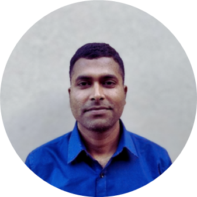

# RAGUNATH MARKANDAN
### 🚀 Lead Engineer | Solution Architect | Technical Consultant
**New Zealand Citizen**

📧 **mragunath@outlook.com** | 📱 **+64 22 160 7798** | 🔗 **[LinkedIn](https://www.linkedin.com/in/ragunath-markandan/)**

📍 **Upper Hutt, Wellington, New Zealand**

---

## 🎯 EXECUTIVE SUMMARY

**20+ years** of experience as a **quality-focused Technical Leader** specializing in solution design, engineering excellence, and digital transformation. Proven track record in architecting and delivering scalable, high-impact solutions that drive measurable business outcomes.

**Core Expertise:** Full-stack development • Cloud architecture • Team leadership • DevOps practices • Enterprise systems

> *"Transforming complex technical challenges into elegant, scalable solutions that deliver continuous value"*

---

## 💻 TECHNICAL EXPERTISE

| Area | Skills |
|------|---------|
| **🚀 Languages** | C# • Java • Python • JavaScript |
| **🧪 Testing** | xUnit • Cypress • Selenium • Playwright • JUnit • TestNG |
| **💾 Data** | Snowflake • SQL Server • PostgreSQL • MongoDB • DynamoDB • Couchbase • Oracle |
| **📡 Messaging** | AWS SQS/SNS • Apache Kafka • IBM MQ • RabbitMQ |
| **⚡ Serverless** | AWS Lambda • Azure Functions • Step Functions • Logic Apps |
| **🐳 Containers** | Amazon EKS • Azure AKS • Red Hat OpenShift |
| **🏗️ IaC** | Terraform • AWS CDK • PowerShell • Vagrant |
| **🔄 CI/CD** | TeamCity • Azure Pipelines • AWS CodePipeline • Jenkins • Spinnaker |
| **☁️ Cloud** | AWS • Microsoft Azure • VMware vCenter |
| **📊 Monitoring** | Dynatrace • Sumo Logic • New Relic • Datadog |

---

## 🏢 PROFESSIONAL EXPERIENCE

### 🚀 Lead Engineer
**Kiwibank** | 📅 *Nov 2021 – Present* | 📍 *Wellington, NZ*

<strong>Key Achievements & Responsibilities</strong>

✅ **Technical Leadership**: Drive cross-functional technical initiatives, solving high-impact challenges across multiple teams  
✅ **Engineering Excellence**: Define and champion core engineering principles for consistency, scalability, and technical excellence  
✅ **Team Development**: Mentor and grow 5+ engineers while partnering with Engineering Managers on talent development  
✅ **Strategic Decision Making**: Lead complex technical decisions with high risk/low reversibility impact  
✅ **Team Scaling**: Bootstrap and scale new engineering teams from inception to production readiness  
✅ **Collaboration**: Foster effective multidisciplinary squad collaboration for high-quality deliverables

---

### ⚡ Senior Engineer
**Xero Ltd** | 📅 *Apr 2018 – Nov 2021* | 📍 *Wellington, NZ*

<strong>Key Achievements & Responsibilities</strong>

**🎯 Core Responsibilities:**
- ✅ **Product Excellence**: Developed high-quality, scalable software products through collaborative cross-functional teamwork
- ✅ **Technical Leadership**: Contributed to solution architecture designs and conducted comprehensive code reviews
- ✅ **Engineering Standards**: Championed Xero's engineering practices and standards across software delivery processes
- ✅ **DevOps Innovation**: Automated development lifecycle for seamless CI/CD implementation
- ✅ **Platform Enhancement**: Drove platform-wide improvement and stabilization initiatives
- ✅ **Team Mentorship**: Provided technical guidance and knowledge sharing to ensure best practice adoption

**🏆 Key Achievements:**
- 🚀 **Process Automation**: Successfully automated delivery processes for continuous integration and deployment
- 📈 **Agile Optimization**: Identified and improved agile methodologies and delivery processes for enhanced efficiency
- 🎯 **Incident Leadership**: Led critical incident responses and post-mortems, proactively identifying and resolving future issues
- 👥 **Talent Acquisition**: Participated in technical interviews to identify top talent, collaborating closely with leadership
- ⏰ **Crisis Management**: Demonstrated exceptional ability to prioritize and coordinate time-sensitive, critical responsibilities
- 🏦 **Domain Expertise**: Developed deep expertise in bank-feeds domain architecture and scalability
- 🌟 **Strategic Secondment**: 8-month assignment with "Sums of Anarchy" team, training on latest technologies (K8s, .NET Core)
- 🤝 **Team Building**: Built trust through open communication and continuous feedback loops
- ☁️ **Platform Pioneer**: Early adopter of PaaS Kubernetes platform, successfully implementing through to production
- 📚 **Knowledge Equity**: Ensured equal opportunities for team members to acquire domain and technical expertise

---

### 🏛️ Technical Lead/Technical Consultant
**DXC Technology** | 📅 *Oct 2012 – Apr 2018* | 📍 *Wellington, NZ*

<strong>Key Achievements & Responsibilities</strong>

**🎯 Core Responsibilities:**
- 🏛️ **Mission-Critical Leadership**: Led cross-functional development team for **New Zealand Passport System** - high-availability national identity platform
- 🔧 **End-to-End Delivery**: Managed complete software lifecycle from design reviews to production maintenance
- 🤝 **Client Partnership**: Collaborated closely with government clients to ensure business continuity and operational excellence
- 💾 **Database Excellence**: Led database development initiatives including performance optimization and scalability enhancements
- 🚨 **Crisis Management**: Efficiently managed high-severity production issues with rapid resolution and minimal downtime
- 💡 **Innovation Leadership**: Identified and championed adoption of emerging technologies through regular team discussions

**🏆 Key Achievements:**
- ✅ **Government Compliance**: Ensured adherence to strict government standards for data privacy, security, and availability
- ✅ **Stakeholder Collaboration**: Built strong relationships with business stakeholders, architects, and QA teams
- ✅ **System Reliability**: Delivered robust, scalable digital services supporting millions of citizens and government agencies
- ✅ **Performance Optimization**: Achieved significant database performance improvements through strategic optimization
- ✅ **Team Development**: Fostered continuous learning culture through technology knowledge sharing sessions

---

### 🏗️ Technical Architect/Technical Lead
**HCL Technologies** | 📅 *Jun 2010 – Sep 2012* | 📍 *Wellington, NZ*

<strong>Key Achievements & Responsibilities</strong>

**🎯 Core Responsibilities:**
- 🌍 **Global Team Leadership**: Led both onshore (Wellington) and offshore development teams for **New Zealand Corrections Systems**
- 🏛️ **Critical Infrastructure**: Managed design, development, and maintenance of public safety and justice operation systems
- 🤝 **Business Continuity**: Partnered closely with government clients to ensure seamless business-as-usual operations
- 🚨 **Production Excellence**: Efficiently resolved high-severity production issues with minimal impact to critical services
- 👥 **Knowledge Transfer**: Championed IOMS application architecture education for new team members
- 🔧 **Cross-Functional Support**: Provided technical assistance to testing and support teams for rapid problem resolution

**🏆 Key Achievements:**
- ✅ **Quality Standards**: Maintained exceptional code quality and system reliability across full SDLC
- ✅ **Regulatory Compliance**: Delivered secure, scalable solutions meeting stringent government operational requirements
- ✅ **Innovation Pioneer**: Led POC development for cross-platform communication between desktop and web applications
- ✅ **Legacy Integration**: Successfully implemented parallel running of legacy and modern systems with seamless communication
- ✅ **Team Development**: Mentored team members on complex system architecture and best practices
- ✅ **Problem Resolution**: Established efficient troubleshooting processes reducing incident response time

---

### 💊 Senior Software Engineer
**iSOFT R&D PVT Ltd** | 📅 *Jun 2008 – Jun 2010* | 📍 *India*

<strong>Key Achievements & Responsibilities</strong>

**🎯 Core Responsibilities:**
- 🏥 **Healthcare Innovation**: Core developer for **LORENZO Care Event Management** module serving UK NHS
- 🔧 **Framework Development**: Collaborated on core framework development including enhancements and critical bug fixes
- 💾 **Database Optimization**: Led database development initiatives with focus on performance optimization
- 🔄 **Build Automation**: Managed integrated build processes using NAnt and CruiseControl.NET for Care Event modules
- 🧪 **Quality Assurance**: Implemented comprehensive unit testing frameworks using NUnit for care modules
- 🎨 **UI/UX Development**: Designed intuitive user interfaces and developed custom controls for healthcare workflows

**🏆 Key Achievements:**
- ✅ **Critical Systems**: Delivered mission-critical healthcare software supporting national health services
- ✅ **Performance Excellence**: Achieved significant database performance improvements for large-scale healthcare data
- ✅ **Quality Standards**: Established robust testing environments ensuring high-quality deliverables
- ✅ **Crisis Management**: Efficiently resolved high-severity issues in production healthcare environments
- ✅ **Development Environment**: Created optimized development and testing environments for team productivity

---

### 🌐 Software Engineer
**TEKSOFT CS PVT LTD** | 📅 *May 2003 – Jun 2008* | 📍 *India*

<strong>Key Achievements & Responsibilities</strong>

**🎯 Core Responsibilities:**
- 🚀 **Web Innovation**: Designed and developed cutting-edge reusable AJAX-based web controls
- 🎨 **UI/UX Excellence**: Created intuitive graphical user interfaces with custom functionality based on client specifications
- 🧪 **Quality Assurance**: Implemented comprehensive unit testing protocols ensuring high-quality deliverables
- 🤝 **Cross-Team Collaboration**: Partnered with Quality Analysis teams to track and resolve project module issues
- 📚 **Best Practices**: Applied industry-standard design and implementation practices under expert guidance

**🏆 Key Achievements:**
- ✅ **Component Architecture**: Built scalable, reusable frontend components for enterprise applications
- ✅ **Client Satisfaction**: Delivered custom solutions meeting diverse client requirements and specifications
- ✅ **Quality Excellence**: Maintained zero-defect delivery through rigorous testing and quality control processes
- ✅ **Process Improvement**: Contributed to development process optimization and standardization
- ✅ **Technical Foundation**: Established strong foundation in software engineering principles and practices

---

## 🎓 EDUCATION

🏛️ **Master of Computer Applications** | Bharathidasan University, India  
🏛️ **Bachelor of Computer Applications** | Bharathidasan University, India

---

## 🌟 KEY DIFFERENTIATORS

- 🎯 **Government Systems Expertise**: Proven track record with mission-critical national systems (Passport, Corrections)
- 🚀 **Scale Leadership**: Successfully scaled teams and systems at high-growth companies (Xero, Kiwibank)
- 🔄 **Full-Stack Versatility**: End-to-end delivery capability from architecture to production support
- 🌍 **Global Experience**: Led distributed teams across multiple time zones and cultures
- 📈 **Business Impact**: Consistent delivery of solutions that drive measurable business outcomes

---

*"Bridging the gap between complex technical challenges and elegant business solutions"*

